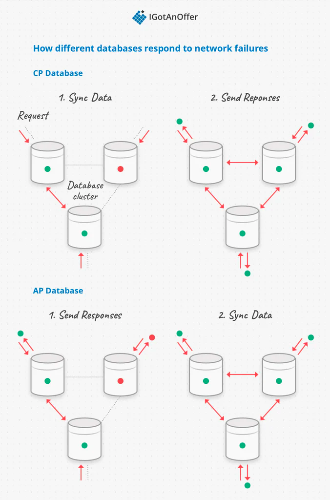
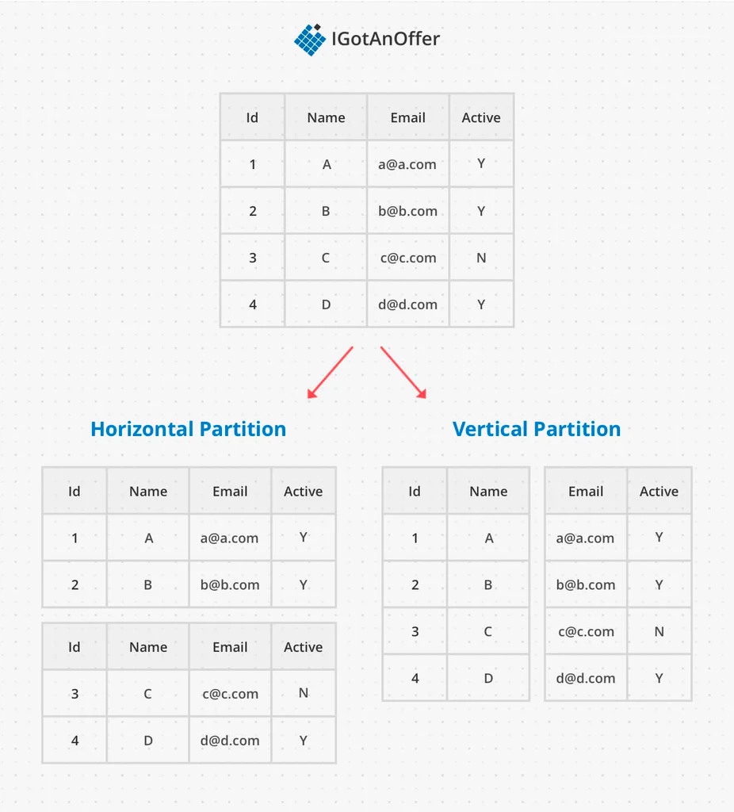

# Databases

Notes from:
- https://igotanoffer.com/blogs/tech/databases-system-design-interview

---

> A database is a systematic collection of data. 
> They support electronic storage and manipulation of data. Databases make data management easy.

Database main function:
- store data
- update and delete data
- return data according to a query
- administer the database

A database needs to be:
- reliable
- efficient
- correct

## CAP theorem

> The CAP theorem says that any distributed database can only satisfy two of the three features.

- Consistency: every node responds with the most recent version of the data
- Availability: any mode can send a response
- Partition Tolerance: the system continues working even if communication between any of the nodes is broken

Tradeoffs: 
Stability of the network is not guarantee, meaning a db should always satisfy Partition tolerance. 
BUT it implies a tradeoff between Consistency and Availability: 
1. CP: Satisfy concurrency and rollback unfinished operations and wait until all nodes are back
2. AP: Continue responding but risk inconsistencies

## Transactions: ACID

> A transaction: series of database operations = single unit of work. They wither all succeed or all fail.

- Atomicity: all operations succeed or fail
- Consistency: a successful transaction leave the db valid with no schema violations
- Isolation: transactions can be executed concurrently
- Durability: A committed transaction is persisted in memory

Reality:
- Theoretically impossible to implement together
- Usually relational databases do support ACID transactions, and non-relational databases don’t

## Schemas

> A schema is to define the shape of a data structure, and specify what kinds of data can go where.

- database level structures: tables and indexes
- data level constraints: field types(string, boolean, ref...)
- it can be one schema across the DB or different entities with different schemas

- Computationally expensive: 
  - enforce a schema it is safe, any queries will return data conforms to the schema
  - schema properties have to be confirmed on every operation of write, update and delete
- Difficult to scale:
  - many constraints more difficult as the reference span clusters and schema rules need to be verified across the network

Star and snowflake TODO

## Scaling

Scaling is necessary to implement databases in distributed clusters as dataset sizes grows more and more.

- Vertical scaling: adding CPU and memory resources to a single computer
  - ➕ fairly straight forward
  - ➖ much lower overall capacity
- Horizontal scaling: adding more computer to a cluster
  - ➕ can be sized dynamically without downtime
  - ➖ relational databases struggle to scale horizontally

---
## Relational Databases

> A database with logical organisation and rules of the data, it uses a relational data model.

It is composed of:
- tables with rows
- columns of predetermined data types
- foreign key columns to represent relationship
- primary key column: not null and unique only one primary key
- indexes

Behaviour:
- Enforce constraints to ensure data values and relationships are always valid
- ACID transactions almost always implemented to ensure schema conformance

SQL:
- Relation database = SQL (Structured Query Language) standard query language for relational models
- SQL is declarative = tell what you want to the database and database is the query planner
- Tuning the query planner is one of the primary optimisations techniques

Index:
- Add index when a column is frequently accesses
- Speed up the search
- Index = a table that has a copy of the column of interest and a foreign key reference to the original table

- Special ordering data structures on indices
- Access faster than scanning row by row
- ➕ Perf is boost on reads
- ➖ Slower writes: each index needs to get updated in addition to the primary table

**Relational databases are almost always CP because guaranteeing consistency is important.**
Making sure no matter what transactions occur, database is **always in a valid state**.

When to use:
- there are many-to-many relationships between entries
- data needs to follow the predetermined schema
- relationships between data always need to be accurate

- The top industry technologies for relational databases are:
- Oracle
- MySQL
- PostgresQL

Disadvantages:
- hard to scale over distributed clusters
- split up the data there will be relationships between data entries on different nodes
- cross-node relationships get updated, nodes have to communicate with each other to normalize (keep sync) the data
- db operations are slower because of the network communication
==> tradeoff data replication and partition
- distributed systems are moving away from relational models:
  - difficult to maintain relations over the cluster
  - need more flexibility around schema

NB:
Some database are multi model and supports bth relational and non relational models.

---
## Non-relational Databases

> Non-relational databases are optimised for use cases that need scalability, schema flexibility or specilised query support.

No SQL:
- use other query languages
- most often implement SQL or SQL like query 
- the underlying execution the queries is different from relational database

- AP or CP depending on the target
- AP: eventual consistency still happens over time, not guarantee exactly after a transaction is complete

### Graph database

> Graph databases model data with nodes and edges.

- Most similar to a relational data model because good at representing data with lots of relationships
- ➕ Queries dont's need joings to follow relationship edges because no tables
- ➕ Good for queries that traverse many edges e.g.: social network analytics

In the industry:
- Cassandra
- Neo4J
- CosmosDB

### Document store

> Document stores are usually simple JSON objects stored with a key identifier.

- Set of information pertaining to a single topic
- Usecase example: archive medical records
- Easy to update a single document without updating the entire database
- Example: Add a location field to articles but not updated the previous one

In the industry:
- MongoDB
- Couchbase
- DynamoDB

## Key value store

> A Key-Value store is similar to a document store, but the data stored in the value is opaque.

- Simple read, overwrite and delete operations
- no schemas, no joins or indices
- Like "large hash table"
- Very easy to scale
- Suitable for caching
- When the values need to be large, this kind of database is referred to as an Object Store, or Blob Store. 
- In this case, the data might be serialized and optimized for large file sizes. Use cases include videos, images, audio, disk images, and log binaries. 

In the industry: 
- Redis
- DynamoDB
- CosmosDB
- Memcached
- Hazelcast

## Column-family Databases

## Search Engine Database

- Elasticsearch
- Splunk
- Solr

## Time Series Database

- Prometheus
- InfluxDB
- Kdb+

## Summary

Before choosing a database, it is important to consider:
- data size
- structure
- relationships
- how important it is to enforce schemas and ensure consistency

### Relational database

- many-to-many relationships
- data and data relationships need to strictly follow schema
- consistent transactions are important
- hard to scale because relationships are hard to partition effectively

### Graph database

- many-to-many relationships (graph structure)
- fast at following graph edges
- suited to complex network analytics
- less mature technology than Relational

#### Document store

- isolated documents
- retrieve by a key
- documents with different schemas that are easy to update
- easy to scale

### Key-value store / object store

- opaque values
- no schema or relationships known to the database
- very simple operations
- easy to scale

### Column-family database

- groups related columns for storage (easy to scale)
- memory effective for sparse data

### Search engine database

- large amounts of unstructured data
- full text search or fuzzy search service

### Time series database

- data is ordered by time
- many data streams
- real time entry ordering functionality

---
### SQL or No SQL reasons

Reasons for SQL:

- Structured data
- Strict schema
- Relational data
- Need for complex joins
- Transactions
- Clear patterns for scaling
- More established: developers, community, code, tools, etc
- Lookups by index are very fast

Reasons for NoSQL:

- Semi-structured data
- Dynamic or flexible schema
- Non-relational data
- No need for complex joins
- Store many TB (or PB) of data
- Very data intensive workload
- Very high throughput for IOPS 

Sample data well-suited for NoSQL:
- Rapid ingest of clickstream and log data
- Leaderboard or scoring data
- Temporary data, such as a shopping cart
- Frequently accessed ('hot') tables
- Metadata/lookup tables

## Normalization and Denormalization

Normalization is the technique of dividing the data into multiple tables to reduce data redundancy and inconsistency and to achieve data integrity. 
On the other hand, Denormalization is the technique of combining the data into a single table to make data retrieval faster.

1. Normalization is used in OLTP system, which emphasizes on making the insert, delete and update anomalies faster. 
As against, Denormalization is used in OLAP system, which emphasizes on making the search and analysis faster.
2. Data integrity is maintained in normalization process while in denormalization data integrity harder to retain.
3. Redundant data is eliminated when normalization is performed whereas denormalization increases the redundant data.
4. Normalization increases the number of tables and joins. In contrast, denormalization reduces the number of tables and join.
5. Disk space is wasted in denormalization because same data is stored in different places. On the contrary, disk space is optimized in a normalized table.

# Sharding

> Sharding is essentially the horizontal scaling of a database system that is accomplished by breaking the database up into smaller “shards”,
> which are separate database servers that all contain a subset of the overall dataset.

# Resources

📚 Readings
- https://stackoverflow.com/questions/11292215/where-does-mongodb-stand-in-the-cap-theorem#11297667
