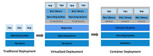

# Kubernetes

## Overview

Kubernetes is a portable, extensible, open source platform for managing containerized workloads and services, that facilitates 
both declarative configuration and automation. It has a large, rapidly growing ecosystem. Kubernetes services, support, and tools are widely available.

### Back in time

**Traditional deployment era**
- run applications on physical servers. 
 
**Virtualized deployment era**
- run multiple VM on a single physical server's CPU
- applications are isolated ==> more security
- better utilisation of resoures ==> better scalability ==> reduce hardware costs
- each VM is a full machine running all the components: OS on top of hardware

**Container deployment era**
- Share the OS among the applications
- Lightweight
- own filesystem, share of CPU, memore, process space and more
- decoupled from the underlying infrastructure, portable accross clouds and OS distrib

**Advantages of containers**
- easier to create and deploy application
- continuous dev, integration and deploy (CI/CD), (efficient rollback)
- decouple app and infra
- observability: application health and other signals
- cloud and OS portability
- focus on applicative management: raise level of abstraction
- loosely coupled: micro-services applications, not a monolithic stack
- resource isolation, predicablt application perf
- resource utilisation, high efficiency

## What Kubernetes does

It takes care of scaling and failover, provides deployment patterns. e.g.: Manage canary deployment

**Service discovery and load balancing**
- expose a container using the DNS name or using their own IP address
- traffic is high, able to load balance and distribute the network traffic so that the deployment is stable

**Storage orchestration**
- automatically mount a storage system of your choice: e.g.: such as local storages, public cloud providers, ...

**Automated rollouts and rollbacks**
- describe the desired state for your deployed containers ==> change the actual state to the desired one
- automate to create new containers for your deployment, remove existing containers and adopt all their resources to the new container

**Automatic bin packing**
- a cluster of nodes that it can use to run containerized tasks
- describe how much CPU and memory (RAM) each container need ==> Kubernetes can fit containers onto your nodes to make the best use of your resources

**Self-healing**
- restarts containers that fail
- replaces containers
- kills containers that don't respond to your user-defined health check

**Secret and configuration management**
- store and manage sensitive information, such as passwords, OAuth tokens, and SSH keys. Y
- deploy and update secrets and application configuration without rebuilding your container images, and without exposing secrets in your stack configuration

> Additionally, Kubernetes is not a mere orchestration system. In fact, it eliminates the need for orchestration. Kubernetes comprises a set of independent, composable control processes that continuously drive the current state towards the provided desired state. 
> It shouldn't matter how you get from A to C. Centralized control is also not required. This results in a system that is easier to use and more powerful, robust, resilient, and extensible.

## Cluster Architecture

## Containers

## Workloads

## Services, Load Balancing and Networking

## Storage

## Configuration

## Security

## Policies

## Scheduling, Preemption and Eviction

## Resources

📚 **Readings** 
- https://kubernetes.io/docs/concepts/

📺 ** Videos**
- https://www.youtube.com/watch?v=a1Uwoq1Yv6U&list=PLmw3X80dPdlzksg6X9s23LEkLMWFGGUn5